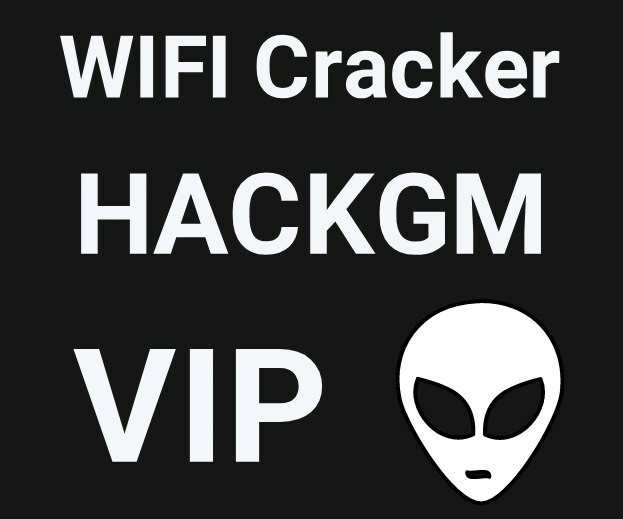
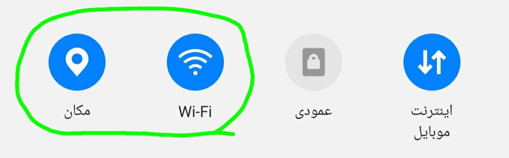

# Cracker-Wifi-Android
برنامه کرک وای فای در اندروید - Cracker WIFI in android

<h5>⚠️توجه: عواقب هرگونه سو استفاده از این برنامه با خود شخص خواهد بود.</h5><h3>
⚙این برنامه چطور کار میکنه؟
</h3>
<h5>
ابتدا لوکیشن و وای فای خود را روشن کنید و وارد برنامه بشید:
</h5>

 
و یک فایل پسورد لیست انتخاب میکنید برای اسکن کردن پسورد ها،
 
سپس در قسمت چک تایم  میزان سرعت کرک رو میتونید بر اساس فاصله ای که با تارگت مورد نظر دارید تنظیم کنید:
 
در هر سیستمی سرعت کرک متفاوت هست مثلا مودم رو که تست کردیم تا 1.5 ثانیه جوابگو بود اما کرک وای فای یه گوشی اندروید در 3 ثانیه عمل میکرد
 
 تارگت اگه یه گوشی اندرویدی باشه باید داده های گوشیش روشن باشه که کرکر بتونه پسورد رو تشخیص بده!
 
همینطور خرید یک دستگاه افزایش سیگنال وای فای در افزایش سرعت کرک کمک زیادی میکنه.
 
 
<h5>
📥لینک دانلود کرکر وای فای به همراه پسورد لیست:
 
<a href="https://www.mediafire.com/file/lmsl4k1a98a8z67/Cracker+wifi+VIP.zip/file" >https://www.mediafire.com/file/lmsl4k1a98a8z67/Cracker+wifi+VIP.zip/file</a>
 
